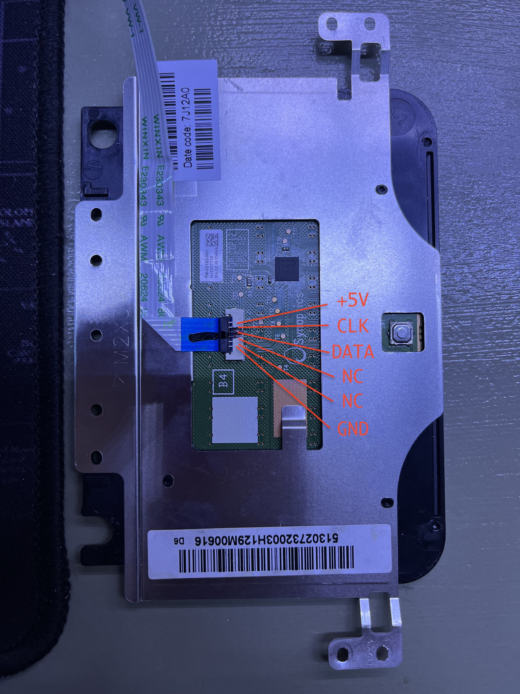
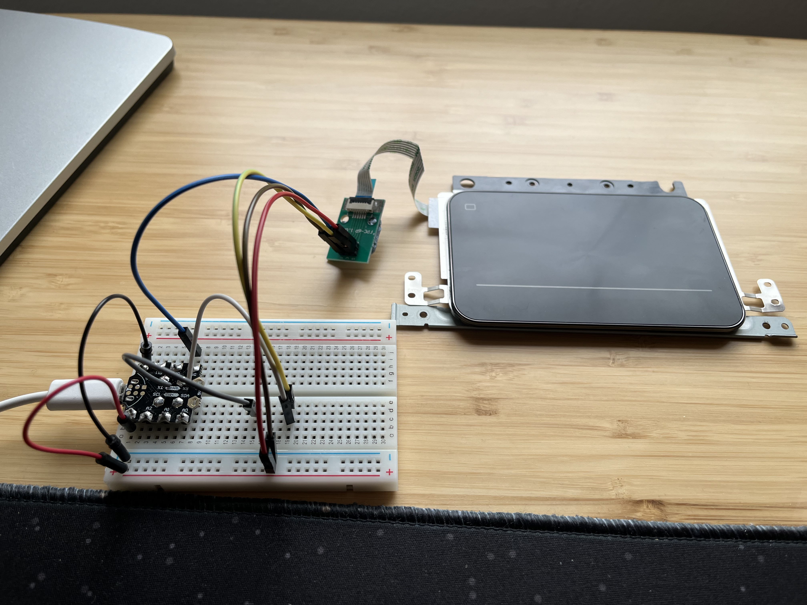

# Laptop Touchpad Project

## Context

I harvested a touchpad from an old HP Envy Sleekbook 6 and wanted to use it as a standalone mouse. It's a clickpad. I.e. it has only one physical button and right click is simulated in software.

Goals:
* Cursor movements.
* Left click and right click (with two fingers).
* Two-finger scrolling.
* Make a housing for it.

Status:
* Everything listed above is fully implemented.
* No rigorous testing has been done.
* Some basic error handling is done.
* I have no problem using it as a daily drive.
* Housing is not done yet. I want to use a USB-C connector. My dev board is micro USB. I need to either get a USB-C dev board (such as Elite-C) or a USB-C breakout PCB.

Most laptop touchpads are made by Synaptics. They usually use a PS/2 interface. By default (i.e. without any special drivers), they can usually simulate a regular PS/2 mouse. I.e. they can report finger movements and button clicks. But that's about it. They don't support more sophisticated gestures we normally find on laptops. To achieve those gestures, we need to implement proprietary but published (with some caveats) Synaptics protocols, documented in [Synaptics PS/2 TouchPad Interfacing Guide](touchpad_RevB.pdf).

## Touchpad info
* Pulled from an HP Envy Sleekbook 6
* Synaptics chip # T1320A
* Physical pinout, reverse engineered after watching this [YouTube video](https://www.youtube.com/watch?v=XdznW0ZuzGo&t=381s)


More info obtained from programatic queries, based on section 4.4. Information queries.

* Query 0x00 (Identify TouchPad): 01 47 18. 
  - Version 8.1

* Query 0x01 (Read TouchPad Modes): 20 87 40.
  - Model 0x0887

* Query 0x02 (Read Capabilities): D0 01 23
   - Extended capability: yes 
   - Extended queries: 13
   - Middle button: no
   - Model sub number: 01
   - Pass through: no
   - Low power: no
   - Multi finger report: yes
   - Can sleep: no
   - Four buttons: no
   - Ballitics: no
   - Multi finger detect: yes
   - Palm detect: yes

* Query 0x03 (Read Model ID): 01 E2 B1
  - Absolute mode: yes
  - Geometry: rectangule

* Query 0x06 (Read Serial Number Prefix): 00 00 00

* Query 0x07 (Read Serial Number Suffix): 00 00 00

* Query 0x08 (Read Resolutions): 2F 80 42
  - x units per mm: 47
  - y units per mm: 66
  
* Query 0x09 (Extended Model ID): 84 03 00
  - Light control: no
  - Peak detect: no
  - Glass pass: no
  - Vertical wheel: no
  - Ext. W mode: yes
  - H Scroll: no
  - V Scroll: no
  - Extended buttons: 0
  - Product ID: 0x00

* Query 0x0C (Continued Capabilities): 12 6C 00
  - Covered Pad Gesture: no
  - MultiFinger Mode: 1.0
  - Advanced Gestures: no
  - ClearPad: no
  - Reports Max Coordinates: yes
  - TouchButton Adjustable Threshold: no
  - InterTouch: yes
  - Reports Min Coordinates: yes
  - Uniform ClickPad: no (Hinged mechanism)
  - Reports V: yes
  - No Absolute Position Filter: no
  - Deluxe LEDs: no
  - ClickPad: One-button ClickPad

* Query 0x0D (Maximum Coordinates): B1 6B 94
  - max x: 5686 
  - max y: 4748

* Query 0x0F (Minimum Coordinates): 27 94 22
  - min x: 1256
  - min y: 1106

## Development setup


## Implementing PS/2 on an MCU
I'm using an atmel mega32u4 to interface with the touchpad. Any Leonardo clone should work. The reason I picked this MCU is its native USB HID support. It also has a 5V logic level, which is what PS/2 uses, so there's no need to a level shifter. Another alternative is to use tinyusb library to bit bang USB protocol on supported MCUs. It's probably pretty straight-forward too.

Basically, I implemented syncrhonous writing, synchronous reading, and asynchronous reading. Synchronous writing because async writing is difficult to use. However, given the async nature of PS/2 protocol, it makes sense to have async, interrupt based reading. I.e. bits are transferred via interrupts and stored in a buffer. I have also implemented synchronous reading as a means to read responses after each write.

 I'm using [external interrupts](https://developerhelp.microchip.com/xwiki/bin/view/products/mcu-mpu/8-bit-avr/structure/extint/) to interact with the clock pin. So the clock pin needs to be one of these: 0, 1, 2, 3, 7 (D2, D3, D1, D0, E6, respectively). It's also possible to use pin change interrupts with slight changes to the code:

```
*(digitalPinToPCICR(clock_pin)) |= 1 << digitalPinToPCICRbit(clock_pin);
*(digitalPinToPCMSK(clock_pin)) |= 1 << digitalPinToPCMSKbit(clock_pin);

... 

ISR(PCINT0_vect) {
   ...
}
```

With the PS/2 protocol implemented, it's really straight-forward to interact the touchpad as a standard PS/2 mouse. The code is [here](https://github.com/delingren/ps2_mouse).

The rest of this doc focuses on the proprietary Synaptics expansion of the PS/2 protocol.

## Data packets
The touchpad sends 6-byte packets to the host. These packets contain information such as finger positions, pressure, width. This particular touchpad can detect 3 fingers. But it only reports the positions of two. When more than one finger is pressed, it reports the states of two fingers in alternating packets.

Since the communication is inevitably noisy, packets could be lost or altered. And it's not very critical to catch each and every frame. Some packets have distinctive features (e.g. fixed bits at certain places) and can be used as synchronization and recovery packets. So if an unexpected packet is received, I keep discarding packets until I'm in sync again.

## State machine logic
I am simulating the behaviour of a MacBook since that's what I'm used to. Most PC laptops behave the same too, with "tap to click" feature turned off. In the following text, whenever I say "two fingers", I mean two or more fingers.

For now, we only do tracking, scrolling, left and right buttons, where right button click is simulated with a two finger click, just like MacBook. Windows optionally supports this too, as long as the touchpad is multi-touch.

The logic is quite complicated. I might need to give it a little more thought and simplify a little. For now, we have three main valid states, identified by two state variables, finger count and button state. Finger count is the number of fingers on the pad. Button state is a bitmap representing the states of left and right buttons.

### Idle
This is where no fingers are on the touchpad. Conditions:
* finger count == 0
Note that even when there's no fingers are pressed, the button could still be pressed, by a non captive object such as a pen.

### Tracking
This is the state where we report the coordinate delta to the OS who will move the cursor accordingly. There are a couple of substates. conditions:
* finger count == 1 || finger count == 2 && button state != 0

When one finger is pressed, we're tracking regardless if the button is pressed. When two fingers are pressed and the button is *not* pressed, we always scroll. But if two fingers are pressed and the button is also pressed, we also track. This is MacBook's behaviour, which is different from Windows, at least Windows 11 on an HP Envy x360.

### Scrolling
This is the state where two fingers are on the pad and their vertical movements are treated as scrolling. Conditions:
* finger count == 2 || button state == 0

## Optimizations

### Smoothing
I found that if we faithfully report the finger positions in each frame, the cursor wobbles a lot, due to inherent noise and instability of human fingers. To mitigate, a few mechanisms are implemented:

* Threshold. If the delta between two frames is below a threshold, we assume it's not intentional. The number is emperical and I fine tuned it a few iterations to a place where I'm happy with false positives and false negatives.
* Averaging. Instead of reporting the position of each frame, I keep track of the average of last 5 frames, to remove sudden movements. I copied some of the logic from [VoodooPS2 driver](https://github.com/acidanthera/VoodooPS2/blob/master/VoodooPS2Trackpad/VoodooPS2TrackpadCommon.h).

### Precision Scrolling
Scrolling seems to have much less granularity. The HID report uses an integer. I find it quite jerky to even report an amount of 1 in each frame. The reason is the frame rate is too high.

So, I decided to have two scrolling intentions: precision scrolling and fast scrolling. When the finger movements are slow and small, I only generate a report every few frames, and the movement is only 1. Once the speed has passed a certain threshold, I assume the user's intention is to quickly scroll over a big area. In this case, I report each frame and the amount is proportional to the actual movement.

## TODOs
* Make it more stable with thumb clicks. I'm still a little unhappy when I use the thumb to press the button and another finger to move the cursor. I use this a lot to select text. The thumb position is not very stable although my intention is to keep it still. This can probably be improved by checking the width of the finger, which is reported. A fat finger probably should be given more leeway when it comes to determining the movements.
* Horizontal scrolling. I think this is a standard USB HID feature and should be relatively easy to implement. I need to check the USB HID spec, which is very dry to read.
* Three finger swipes as back or forward button. USB HID supports at least 5 buttons so this should be doable.
* Zooming with two fingers. I'm not sure if this is doable.
* Velocity tracking and inertia. If we keep track of the speed of the movements, we can implement a lot of interesting features. One example is inertia, where if you've been scrolling, after the fingers have been released, it still keeps going for a little, slowing down gradually. Another potential application is to keep the noise tolerance high at zero/very low speed, reducing it once the fingers are moving. This way, we can provide better precision control at low speed.